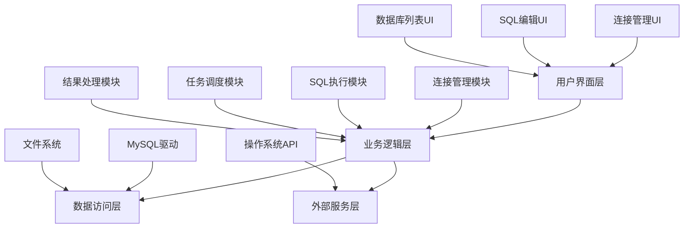

# SQL Batcher 项目开发设计文档

## 1. 概述

### 1.1 项目背景
SQL Batcher 是一个跨平台的桌面应用程序，旨在帮助数据库管理员和开发者批量管理和执行SQL语句，大幅提升工作效率，减少重复劳动。

### 1.2 目标用户
- 数据库管理员 (DBA)
- 后端开发工程师
- 数据分析师

### 1.3 核心价值
解决用户需要对多个数据库实例执行相同SQL语句时，手动切换连接和重复粘贴执行的痛点。

## 2. 技术架构设计

### 2.1 技术选型
| 技术层级 | 方案 | 选择理由 |
|---------|------|----------|
| 前端框架 | Electron | 跨平台桌面应用开发框架，使用Web技术构建，开发效率高 |
| 后端框架 | Node.js | Electron原生运行时环境，适合处理并发数据库连接 |
| 数据存储 | 本地JSON文件 | 无需额外数据库服务器，简化部署 |
| 部署方案 | Electron Packager/Builder | 可打包成各平台原生安装包 |
| UI框架 | HTML/CSS/JavaScript | 原生Web技术，无需额外学习成本 |
| 数据库驱动 | mysql2 | 性能优秀，支持连接池和异步操作 |

### 2.2 项目结构
```
project/
├── main.js             # Electron主进程文件
├── renderer/           # 渲染进程代码
│   ├── index.html      # 主界面HTML
│   ├── css/            # CSS样式文件
│   ├── js/             # JS逻辑文件
│   │   ├── main.js     # 前端主逻辑
│   │   ├── components/ # UI组件
│   │   └── services/   # 业务逻辑服务
├── package.json        # 项目配置和依赖
├── src/                # 后端模块
│   └── database/       # 数据库连接和执行模块
├── data/               # 存放本地数据
│   └── connections.json# 存储数据库连接配置
└── README.md           # 项目说明文档
```

## 3. 功能模块设计

### 3.1 功能架构图


### 3.2 核心功能列表
| 功能模块 | 功能描述 | 优先级 | 复杂度 |
|---------|---------|--------|--------|
| 连接管理 | 允许用户添加、编辑、删除多个MySQL连接配置，并保存 | 高 | 简单 |
| 数据库列表展示 | 连接后，自动列出该连接下所有数据库，并支持多选 | 高 | 中等 |
| SQL编辑器 | 提供一个基础的文本编辑器，用于输入SQL语句 | 高 | 中等 |
| 批量执行 | 用户勾选目标数据库后，点击执行按钮，对每个选中的数据库逐一执行SQL | 高 | 复杂 |
| 执行结果反馈 | 实时显示每个数据库的SQL执行结果（成功/失败），并显示详细错误信息 | 中 | 中等 |
| 本地配置保存 | 将所有连接配置、执行历史等数据持久化到本地文件 | 中 | 简单 |

## 4. 详细设计

### 4.1 连接管理模块
#### 4.1.1 功能描述
允许用户添加、编辑、删除多个MySQL连接配置，并保存到本地JSON文件。

#### 4.1.2 数据结构
```json
{
  "connections": [
    {
      "id": "uuid",
      "name": "连接名称",
      "host": "数据库主机地址",
      "port": 3306,
      "username": "用户名",
      "password": "加密后的密码",
      "createdAt": "创建时间"
    }
  ]
}
```

#### 4.1.3 安全设计
- 密码加密：使用AES等轻量级加密算法对敏感信息进行加密存储
- 安全传输：数据库连接使用SSL/TLS加密传输
- 权限控制：限制应用对系统资源的访问权限

### 4.2 数据库列表展示模块
#### 4.2.1 功能描述
连接成功后，自动列出该连接下所有数据库，并支持多选。

#### 4.2.2 技术实现
使用 `SHOW DATABASES` SQL语句获取数据库列表。

#### 4.2.3 界面设计
- 左侧边栏：显示已保存的连接列表
- 中间面板：显示选中连接下的数据库列表，支持复选框选择
- 右侧面板：SQL编辑器和执行按钮
- 底部面板：执行结果展示区域

### 4.3 SQL执行模块
#### 4.3.1 功能描述
用户勾选目标数据库后，点击执行按钮，对每个选中的数据库逐一执行SQL。

#### 4.3.2 技术实现
使用 `mysql2` 库进行数据库连接和SQL执行，通过异步处理确保UI不被阻塞。

#### 4.3.3 执行流程
1. 获取用户输入的SQL语句
2. 获取用户选择的数据库列表
3. 对每个数据库并行执行SQL语句
4. 收集执行结果并返回给UI层

#### 4.3.4 并发控制
- 限制最大并发数：避免同时连接过多数据库导致性能问题
- 使用连接池：复用数据库连接，减少连接建立开销
- 异步执行：使用Promise或async/await确保非阻塞执行

#### 4.3.5 错误处理
- 连接失败：提示用户检查连接配置
- SQL执行错误：记录错误信息并继续执行其他数据库
- 网络超时：设置合理的超时时间并提示用户

### 4.4 结果处理模块
#### 4.4.1 功能描述
实时显示每个数据库的SQL执行结果（成功/失败），并显示详细错误信息。

#### 4.4.2 数据结构
```javascript
{
  "database": "数据库名称",
  "status": "success|error",
  "message": "执行结果信息",
  "executionTime": "执行耗时"
}
```

#### 4.4.3 展示方式
- 实时更新：每个数据库执行完成后立即更新结果
- 状态标识：使用不同颜色标识成功/失败状态
- 详细信息：点击条目可查看详细错误信息

## 5. 分阶段开发计划

### 5.1 第一阶段：MVP核心验证 (2-4周)
#### 目标
验证核心商业价值，构建最小可行产品，实现批量执行的核心功能。

#### 核心功能
- 连接管理：支持添加/编辑单个MySQL连接，能保存连接信息到本地JSON文件
- 数据库列表：成功连接后，能加载并展示该连接下的所有数据库名称
- 批量执行：实现选中多个数据库后，执行一条SQL语句的功能
- 结果反馈：简单的文本框显示执行结果，标识成功或失败

### 5.2 第二阶段：产品化完善 (4-8周)
#### 目标
完善用户体验，增强功能稳定性，构建稳定可用的完整产品。

#### 新增功能
- UI优化：美化界面，提供更直观的交互体验
- 结果表格化：将执行结果以表格形式展示
- SQL历史记录：记录用户执行过的SQL语句
- 批量导入连接：支持从文件批量导入连接配置

### 5.3 第三阶段：规模化扩展 (6-12周)
#### 目标
支撑更多数据库类型，构建插件生态，实现高级功能。

#### 高级功能
- 多数据库类型支持：支持 PostgreSQL, SQL Server 等其他数据库
- SQL脚本导入：支持从 `.sql` 文件中读取SQL语句进行批量执行
- 任务管理：记录执行任务，支持查看历史任务状态和结果
- 命令行工具：提供一个轻量级的命令行版本

## 6. 风险控制

### 6.1 技术风险
| 风险类型 | 风险描述 | 应对策略 |
|---------|---------|---------|
| 性能风险 | 批量执行大量SQL时，可能因I/O阻塞导致界面卡顿 | 使用异步处理和并发控制，避免主进程阻塞 |
| 安全风险 | 用户输入的敏感连接信息（如密码）未加密存储 | 使用轻量级加密算法对敏感数据进行加密后存储 |
| 兼容性风险 | 不同版本的MySQL或不同数据库类型的SQL语法不兼容 | 提供SQL语法检查功能，并在抽象层进行适配 |

## 7. 测试策略

### 7.1 单元测试
针对各个功能模块编写单元测试，确保核心逻辑正确性。
- 连接管理模块：测试连接配置的增删改查功能
- SQL执行模块：测试SQL语句的正确执行和错误处理
- 数据库列表模块：测试数据库列表的正确获取

### 7.2 集成测试
测试各模块之间的交互，确保数据流正确。
- 连接配置保存和读取测试
- 完整的SQL执行流程测试
- 结果展示和错误处理测试

### 7.3 用户界面测试
验证用户界面的交互和视觉效果。
- 界面布局和响应式设计测试
- 用户操作流程测试
- 跨平台兼容性测试

### 7.4 性能测试
- 并发执行性能测试
- 大量数据处理测试
- 内存泄漏检测

## 8. 部署与发布

### 8.1 构建流程
使用 Electron Packager/Builder 将应用打包成各平台的原生安装包。

### 8.2 发布策略
支持 Windows (.exe) 和 macOS (.dmg) 平台，后续可扩展 Linux 支持。

### 8.3 自动更新
集成 Electron 自动更新机制，确保用户能够及时获取新功能和修复。

### 8.4 安装包优化
- 移除开发依赖，减小安装包体积
- 代码混淆和压缩
- 图标和资源文件优化

## 9. 总结

SQL Batcher 项目通过 Electron 技术栈实现了跨平台的数据库批量执行工具，能够有效提升数据库管理员和开发人员的工作效率。通过模块化设计和分阶段开发策略，确保了项目的可维护性和可扩展性。安全性和性能优化措施保证了产品的稳定性和用户体验。