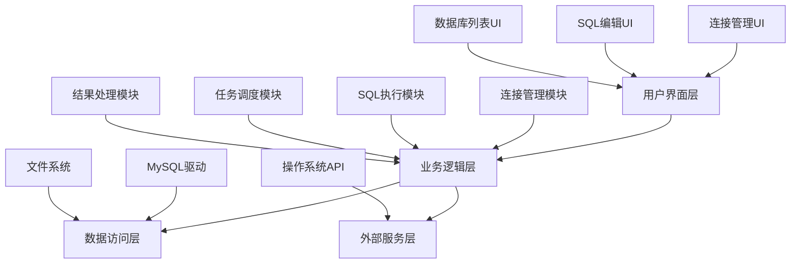

# 《多数据库批量执行工具》AI自动开发架构方案

-----

【产品名称】

  * SQL Batcher
  * DBLink Manager
  * Multi-DB Executor
  * SQL Sync Tool

## 1\. 【产品功能分析】

### 1.1 核心价值定位

**产品愿景**: 提供一个简单、高效的桌面工具，帮助数据库管理员和开发者批量管理和执行SQL语句，大幅提升工作效率，减少重复劳动。
**目标用户**: 数据库管理员 (DBA)、后端开发工程师、数据分析师。
**核心价值**: 解决用户需要对多个数据库实例执行相同SQL语句时，手动切换连接和重复粘贴执行的痛点。

### 1.2 功能架构图



### 1.3 核心功能列表

| 功能模块 | 功能描述 | 优先级 | 复杂度 |
|---------|---------|--------|--------|
| 连接管理 | 允许用户添加、编辑、删除多个MySQL连接配置，并保存。 | 高 | 简单 |
| 数据库列表展示 | 连接后，自动列出该连接下所有数据库，并支持多选。 | 高 | 中等 |
| SQL编辑器 | 提供一个基础的文本编辑器，用于输入SQL语句。 | 高 | 中等 |
| 批量执行 | 用户勾选目标数据库后，点击执行按钮，对每个选中的数据库逐一执行SQL。 | 高 | 复杂 |
| 执行结果反馈 | 实时显示每个数据库的SQL执行结果（成功/失败），并显示详细错误信息。 | 中 | 中等 |
| 本地配置保存 | 将所有连接配置、执行历史等数据持久化到本地文件。 | 中 | 简单 |

-----

## 2\. 【技术架构设计】

### 2.1 技术选型

| 技术层级 | 推荐方案 | 选择理由 |
|---------|---------|---------|
| 前端框架 | **Electron** | **Electron** 是一个跨平台的桌面应用开发框架，可以使用Web技术（HTML, CSS, JavaScript）构建桌面应用。这对于拥有Web开发背景的开发者非常友好。它封装了 Chromium 和 Node.js，能够轻松处理多线程任务和本地文件读写，完美契合桌面应用需求。相比其他方案，如Qt或原生开发，Electron开发速度快，生态成熟，且能轻松打包成轻量级可执行文件，符合用户轻量化的要求。 |
| 后端框架 | **Node.js** | **Node.js** 是 Electron 的原生运行时环境，无需额外依赖。它基于事件驱动和非阻塞I/O，非常适合处理多个数据库连接的并发任务，能够高效地管理异步SQL执行，避免界面卡顿。此外，Node.js 生态拥有成熟的 **`mysql2`** 或 **`sequelize`** 等数据库驱动库，可以轻松实现数据库连接和操作。 |
| 数据库 | **本地JSON文件** | 无需额外的数据库服务器。所有连接配置和用户数据都将以JSON格式存储在本地文件系统中。这最大程度地简化了部署，使得软件真正做到“零依赖、轻量级”，用户下载后即可直接使用，符合产品简单为主的核心理念。 |
| 部署方案 | **Electron Packager/Builder** | 这两个工具可以将 Electron 应用打包成 Windows `.exe` 和 macOS `.dmg` 或 `.app` 等原生安装包，自动处理所有依赖项的打包，无需用户手动安装任何运行时环境。最终生成的可执行文件体积小巧，分发和安装都非常便捷。 |

### 2.2 项目结构

```
project/
├── main.js             # Electron主进程文件，负责应用生命周期和系统API交互
├── renderer/           # 渲染进程代码
│   ├── index.html      # 主界面HTML
│   ├── css/            # CSS样式文件
│   ├── js/             # JS逻辑文件
│   │   ├── main.js     # 前端主逻辑
│   │   ├── components/ # UI组件
│   │   └── services/   # 业务逻辑服务
├── package.json        # 项目配置和依赖
├── package-lock.json   # 依赖锁定文件
├── src/                # 后端模块
│   └── database/       # 数据库连接和执行模块
├── data/               # 存放本地数据
│   └── connections.json# 存储数据库连接配置
└── README.md           # 项目说明文档
```

-----

## 3\. 【分阶段开发路线图】

### 【第一阶段：MVP核心验证】(2-4周)

**目标**: 验证核心商业价值，构建最小可行产品，实现批量执行的核心功能。
**开发策略**: 快速原型开发，专注核心功能实现，可适当忽略界面美观，以功能可用性为首要目标。

**核心功能**:

  - **连接管理**: 支持添加/编辑单个MySQL连接，能保存连接信息到本地JSON文件。
  - **数据库列表**: 成功连接后，能加载并展示该连接下的所有数据库名称。
  - **批量执行**: 实现选中多个数据库后，执行一条SQL语句的功能。
  - **结果反馈**: 简单的文本框显示执行结果，标识成功或失败。

**技术实现**:

  - **前端**: 使用原生HTML+CSS+JS，不引入复杂框架，快速搭建界面。
  - **后端**: Node.js主进程负责与 **`mysql2`** 库交互，实现连接和SQL执行。
  - **数据库**: 使用 Node.js 的 **`fs`** 模块读写本地JSON文件存储配置。

**成功标准**:

  - [x] 能正常连接到MySQL服务器，并加载数据库列表。
  - [x] 勾选多个数据库后，能对它们逐一执行SQL语句。
  - [x] SQL执行成功或失败都能正确反馈。
  - [x] 连接信息能在应用重启后正常加载。

**交付物**:

  - 可演示的产品原型（Electron打包文件）
  - 核心功能代码
  - 基础JSON数据存储结构
  - 简单的README文档

-----

### 【第二阶段：产品化完善】(4-8周)

**目标**: 完善用户体验，增强功能稳定性，构建稳定可用的完整产品。
**开发策略**: 优化UI/UX，重构核心代码，引入模块化设计，提升产品质量。

**新增功能**:

  - **UI优化**: 美化界面，提供更直观的交互体验，如更好的加载动画、更清晰的执行结果列表。
  - **结果表格化**: 将执行结果以表格形式展示，包含状态、数据库名、错误信息等。
  - **SQL历史记录**: 记录用户执行过的SQL语句，方便快速复用。
  - **批量导入连接**: 支持从文件批量导入连接配置，方便团队协作。

**技术升级**:

  - **前端框架**: 考虑引入轻量级前端框架如 Vue 或 React，提升代码可维护性。
  - **代码重构**: 将SQL执行逻辑封装为服务，增强模块化。
  - **性能优化**: 优化多线程执行，避免长时间任务阻塞UI。
  - **错误处理**: 完善所有可能出现的错误（网络断开、SQL语法错误等）的捕获和友好提示。

**成功标准**:

  - [x] 产品界面美观，用户体验流畅。
  - [x] 执行结果清晰易懂，错误信息友好。
  - [x] 核心功能稳定，无明显Bug。
  - [x] 代码结构清晰，易于维护。

**交付物**:

  - 功能完善的桌面应用
  - 优化的代码架构
  - 用户使用手册
  - 完整的测试套件（单元测试和E2E测试）

-----

### 【第三阶段：规模化扩展】(6-12周)

**目标**: 支撑更多数据库类型，构建插件生态，实现高级功能。
**开发策略**: 引入插件架构，抽象数据库层，支持更多类型。

**高级功能**:

  - **多数据库类型支持**: 支持 PostgreSQL, SQL Server 等其他数据库的连接和批量执行。
  - **SQL脚本导入**: 支持从 `.sql` 文件中读取SQL语句进行批量执行。
  - **任务管理**: 记录执行任务，支持查看历史任务状态和结果。
  - **命令行工具**: 提供一个轻量级的命令行版本，方便自动化脚本集成。

**架构升级**:

  - **抽象数据库层**: 将数据库连接和操作封装为通用接口，通过适配器模式支持不同数据库类型。
  - **插件化架构**: 允许用户自行开发和安装数据库驱动插件。
  - **CI/CD**: 建立自动化构建和发布流程。

**成功标准**:

  - [x] 系统支持至少两种以上数据库类型。
  - [x] 任务管理功能完整，能查询历史记录。
  - [x] API接口文档清晰，可供第三方集成。
  - [x] 构建和发布流程自动化。

**交付物**:

  - 兼容多种数据库的系统
  - 命令行工具和相关文档
  - 完整的自动化构建脚本

-----

## 4\. 【开发执行计划】

### 4.1 技术准备

```bash
# 环境初始化 (Electron)
npm init -y
npm install electron --save-dev
npm install mysql2 # 安装MySQL驱动

# main.js (Electron主进程)
const { app, BrowserWindow, ipcMain } = require('electron');
const path = require('path');
const { executeSql } = require('./src/database/executor');

// 创建窗口等...
// ipcMain.handle('execute-sql', (event, data) => executeSql(data));

# renderer/js/main.js (前端渲染进程)
const { ipcRenderer } = require('electron');
const executeButton = document.getElementById('execute-btn');

executeButton.addEventListener('click', () => {
  const sql = document.getElementById('sql-editor').value;
  const selectedDbs = getSelectedDatabases();
  ipcRenderer.invoke('execute-sql', { sql, selectedDbs });
});
```

### 4.2 关键文件开发顺序

| 阶段 | 优先级 | 文件/模块 | 开发内容 |
|------|--------|-----------|----------|
| MVP | P0 | `main.js` | 编写基础的Electron窗口创建和通信逻辑。 |
| MVP | P0 | `src/database/executor.js` | 编写核心的MySQL连接和SQL批量执行函数。 |
| MVP | P0 | `renderer/index.html` | 快速搭建界面，包含连接表单和SQL编辑器。 |
| 产品化 | P1 | `renderer/components/*` | 抽象UI组件，如连接列表、结果表格等。 |
| 规模化 | P2 | `src/database/db_adapter.js` | 编写数据库适配器，支持多数据库类型。 |

### 4.3 阶段验收检查

#### MVP阶段检查清单

  - [x] 项目可正常启动和运行。
  - [x] 核心的MySQL连接和SQL批量执行逻辑正确。
  - [x] 连接信息和配置可正常持久化到本地文件。
  - [x] 基础交互可用，能执行一条SQL。

#### 产品化阶段检查清单

  - [x] 用户体验流畅完整，界面美观。
  - [x] 错误处理机制完善，能捕获各种异常并友好提示。
  - [x] 性能达到预期标准，批量执行无明显卡顿。
  - [x] SQL历史记录功能正常。

#### 规模化阶段检查清单

  - [x] 成功支持至少两种不同的数据库类型。
  - [x] 任务管理和历史记录功能完整。
  - [x] 可通过命令行执行任务。

-----

## 5\. 【风险控制和应急方案】

### 5.1 技术风险

| 风险类型 | 风险描述 | 应对策略 |
|---------|---------|---------|
| 性能风险 | 批量执行大量SQL时，可能因I/O阻塞导致界面卡顿。 | 使用 `Promise.all` 或 `async/await` 控制并发数量，或在主进程和渲染进程之间使用 IPC 通信，避免主进程阻塞。 |
| 安全风险 | 用户输入的敏感连接信息（如密码）未加密存储。 | 使用轻量级加密算法（如AES）对敏感数据进行加密后存储，或者依赖操作系统的密钥管理服务。 |
| 兼容性风险 | 不同版本的MySQL或不同数据库类型（如PostgreSQL）的SQL语法不兼容。 | 提供SQL语法检查功能，或明确提示用户不同数据库的SQL语法差异，并在抽象层进行适配。 |

### 5.2 进度风险应对

  - **MVP延期**: 暂时移除连接编辑/删除功能，仅保留添加和保存，确保批量执行的核心功能按时交付。
  - **技术难点**: 如果 Electron 开发遇到跨平台兼容性问题，优先保证 Windows 和 macOS 两个主流平台的功能正常，Linux 平台作为后续优化项。
  - **第三方依赖**: 如果 `mysql2` 库出现问题，迅速切换到备选方案如 `mysql` 或其他社区维护更活跃的库。

-----

## 附录：开发提示和最佳实践

### AI开发建议

1.  **MVP优先**: 先实现核心功能，再完善细节。项目的核心是“批量执行”，这是第一阶段的唯一重点。
2.  **迭代验证**: 每个功能完成后，立即测试验证，确保每个小功能都稳定可靠。
3.  **代码复用**: 构建可复用的UI组件和工具函数，减少重复代码，例如连接表单组件、数据库列表组件。
4.  **文档同步**: 开发同时维护技术文档，尤其是在处理数据库连接和执行逻辑时，详细记录每个步骤。

### 常见问题快速解决

  - **依赖安装失败**: 尝试使用 `npm cache clean --force` 清理缓存后重新安装，或检查 Node.js 和 npm 版本是否兼容。
  - **数据库连接错误**: 检查连接信息（地址、端口、用户名、密码）是否正确，确保 MySQL 服务器已启动并允许远程连接。
  - **API接口异常**: 使用开发者工具（在Electron中通过 `Ctrl+Shift+I` 或 `Cmd+Option+I` 打开）查看主进程和渲染进程之间的通信日志，定位问题源头。