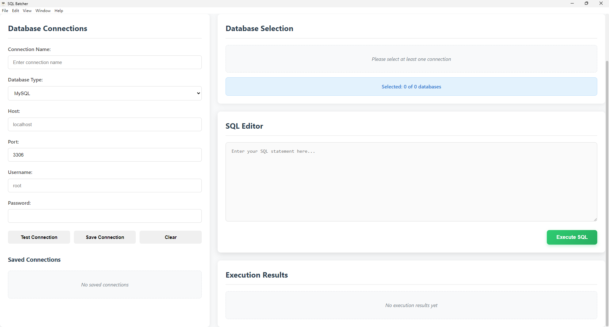

# SQL Batcher

SQL Batcher is a cross-platform desktop application built with Electron.js that allows users to execute SQL statements across multiple databases and connections simultaneously. It provides an efficient way to perform batch operations on various database systems.



## Features

- **Multi-Connection Support**: Connect to multiple databases simultaneously (MySQL, PostgreSQL)
- **Batch SQL Execution**: Execute SQL statements across all selected databases at once
- **Connection Management**: Save and manage database connection configurations
- **Results Display**: View execution results from all databases in a unified interface
- **Cross-Platform**: Works on Windows, macOS, and Linux

## Installation

To install and run SQL Batcher locally:

1. Clone the repository:
   ```bash
   git clone <repository-url>
   ```

2. Navigate to the project directory:
   ```bash
   cd SQL-Batcher
   ```

3. Install dependencies:
   ```bash
   npm install
   ```

4. Start the application:
   ```bash
   npm start
   ```

## Development

To run the application in development mode:

- `npm run dev` - Run the application in development mode with hot reloading
- `npm run dev:react` - Run webpack in watch mode for React components

## Building for Production

To build the application for production:

- `npm run build` - Build the application for production

### Customizing App Icon

To set a custom application icon:

1. Create an `icons` directory in the project root
2. Add your icon files:
   - `icon.ico` for Windows
   - `icon.icns` for macOS
   - `icon.png` for Linux
3. Run the build command

### Production Build Configuration

The production build automatically:
- Disables developer tools
- Optimizes React components
- Packages the application for distribution

## Testing

- `npm test` - Run all tests
- `npm run test:watch` - Run tests in watch mode

## Project Structure

```
SQL-Batcher/
├── main.js                 # Electron main process
├── package.json            # Project configuration and scripts
├── webpack.config.js       # Webpack configuration for React components
├── renderer/               # Renderer process (UI components)
│   ├── index.html          # Main HTML file
│   ├── css/                # Stylesheets
│   └── js/                 # Client-side JavaScript
│       └── preload.js      # Preload script for secure IPC
├── src/                    # Main application source code
│   └── database/           # Database connection and execution logic
├── test/                   # Test files
└── data/                   # Application data (including icons)
```

## Security

This application follows Electron security best practices:
- Uses context isolation
- Disables nodeIntegration
- Uses a preload script for secure IPC communication

## Contributing

Contributions are welcome! Please feel free to submit a Pull Request.

## License

This project is licensed under the MIT License.